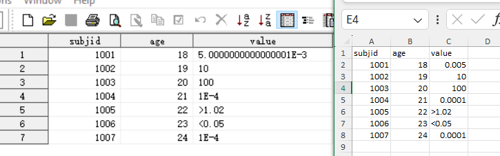
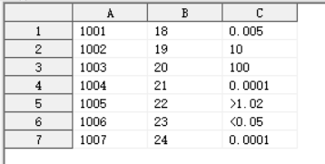

# How to Read Excel Data - A Column with Both Numeric and Character Records
# 如何读入excel数据-一列既有数值又有字符型记录

## 1、read example data
A Column with Both Numeric and Character Records.xlsx

```SAS
proc import datafile="F:\Mygit\blog\Wen-911.github.io\_posts\A Column with Both Numeric and Character Records.xlsx"
	out=test 
	dbms=xlsx replace;
	getnames=yes;
run;
```



## 2、try another method 
## 尝试用其他方法读入

```SAS
/* method 2: 
Assuming columns A through C are all character types 
假设都是字符型 */
data test2;
    infile 'F:\Mygit\blog\Wen-911.github.io\_posts\A Column with Both Numeric and Character Records.csv' dlm=',' firstobs=2; /* 假设第一行为标题 */
    input
        A $  
        B $
        C $ 
        ;
run;
```

